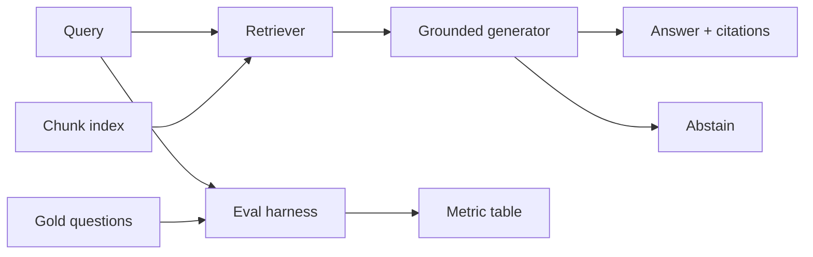

# Sanjesh — Grounded RAG + Offline Eval Harness

End-to-end retrieval-augmented generation **with measurements**, not a ChatGPT wrapper.

The system answers only from retrieved chunks, attaches stable citations (`docId#chunkIndex`), and **abstains** when evidence is weak. An offline harness compares five retrieval configurations on a 48-question gold set.

No API key is required. Retrieval and extractive generation run in-process (TypeScript).

## Why this repo exists

Applied LLM resumes are full of “I built a chatbot with LangChain.” This project is the opposite:

- a **fixed corpus** with versionable chunks
- **lexical and hybrid retrievers** you can ablate
- a **generator that is not allowed to guess**
- a **gold set** that includes out-of-domain questions
- a **table of metrics** that separates retrieval quality from generation faithfulness

That is the shape of work that shows up in RAG / Applied LLM interviews.

## What you can do

| Surface | URL | Purpose |
| --- | --- | --- |
| Playground | `/` | Ask questions, switch retrievers, inspect chunks and latency |
| Eval dashboard | `/eval` | Recall / MRR / nDCG / F1 / faithfulness / abstention / p50–p95 |
| Ask API | `POST /api/ask` | `{ "query": "...", "configId": "hybrid-k6" }` |
| Eval API | `GET` or `POST /api/eval` | JSON summary + traces |

## Architecture

```text
Corpus (18 docs)
    → chunker (stable ids, overlap)
    → BM25 index + TF-IDF vectors
Query
    → retriever (bm25 | tfidf | RRF hybrid | none)
    → extractive generator (sentences from hits + citations)
    → abstain if overlap with top hit is too low
Gold set (48 items)
    → same pipeline × 5 configs
    → IR metrics on answerable items
    → faithfulness / unsupported-claim / abstention accuracy
```



## Retrieval configs

Defined in `src/rag/engine.ts`:

| `configId` | Retriever | k | Role |
| --- | --- | --- | --- |
| `bm25-k4` | Okapi BM25 (`k1=1.2`, `b=0.75`) | 4 | Lexical baseline at generator width |
| `bm25-k8` | BM25 | 8 | Higher recall, noisier context |
| `tfidf-k4` | Cosine TF-IDF | 4 | Second lexical signal |
| `hybrid-k6` | Reciprocal Rank Fusion of BM25 + TF-IDF (`RRF k=60`) | 6 | Default in the UI |
| `closed-book` | none | 0 | Negative control: must abstain |

Hybrid fusion does **not** mix raw scores. It merges ranks:

`score(d) = Σ 1 / (60 + rank_i(d))`

## Generation policy

Implemented in `src/rag/generate.ts`:

1. If there are no hits → abstain.
2. If token overlap between the query and the top chunk is below `0.08` → abstain.
3. Otherwise pick up to three sentences from the hit list, scored by query overlap and rank.
4. Append a citation `[chunkId]` to each sentence.
5. Never call an external LLM. The answer is extractive on purpose: **faithfulness over fluency**.

Abstention string (stable, so eval can detect it):

`در منابع بازیابی‌شده مدرک کافی نیست. پاسخ را حدس نمی‌زنم.`

## Corpus and gold set

- **18 Persian technical documents** on RAG engineering (chunking, BM25, dense retrieval, RRF, faithfulness vs correctness, gold-set design, lost-in-the-middle, citations, latency, hallucination types, rerank, IR metrics, failure modes, prompting, Persian tokenization, abstention, contamination, indexing).
- Source: `src/rag/corpus.ts`
- **48 gold questions** in `src/rag/gold.ts`
  - 40 answerable (`factual` / `comparison` / `procedure`) with `relevantDocIds`
  - 8 `unanswerable` (stock prices, sports, clinical advice, missing papers) to measure hallucination / abstention
- Chunk ids look like `faithfulness#0` so citation and retrieval can be scored automatically.

This is a **holdout-style lab set**, not 300 production items. The harness is built so you can add questions without changing metric code.

## Metrics

Computed in `src/rag/metrics.ts` and aggregated in `src/rag/harness.ts`.

| Metric | What it answers | Notes |
| --- | --- | --- |
| **Recall@k** | Fraction of gold documents found in the top k hits | Averaged only on answerable questions |
| **MRR** | 1 / rank of the first relevant document | Sensitive to the first useful hit |
| **nDCG@k** | Graded ranking quality (binary relevance here) | |
| **Hit rate** | 1 if at least one relevant doc is in top k | Often the right RAG retrieval number |
| **Answer F1** | Token overlap with the short gold answer | Abstain on answerable → 0; abstain on unanswerable → 1 |
| **Faithfulness** | Fraction of answer sentences whose 3-grams overlap the retrieved context (≥ 0.35) | Abstention counts as faithful |
| **Unsupported-claim rate** | `1 - faithfulness` on answerable items | The “hallucinated while answering” slice |
| **Abstention accuracy** | `predicted abstain == shouldAbstain` | Includes the 8 out-of-domain items |
| **p50 / p95 latency** | End-to-end ms | Retrieval and generation are also recorded per query |

**How to read the table**

- Strong retrieval + weak F1 → generator/citation problem.
- Weak retrieval + strong F1 → leakage or lucky extractive overlap; inspect traces.
- `closed-book` should have **high abstention accuracy** and **near-zero hit rate**. If it answers, the generator is cheating.

Faithfulness here is a **cheap, repeatable n-gram proxy**, not an LLM-as-judge and not human annotation. That limitation is documented on the eval page on purpose.

## Project layout

```text
src/rag/
  corpus.ts      knowledge base
  gold.ts        48 labeled questions
  chunk.ts       paragraph packing + overlap
  tokenize.ts    FA/EN tokens, ي/ك normalization
  bm25.ts
  tfidf.ts
  hybrid.ts      RRF + top-k
  generate.ts    extractive + abstain
  engine.ts      configs, retrieve, ask
  metrics.ts
  harness.ts     run all configs × gold
src/app/
  page.tsx       playground
  eval/page.tsx  dashboard (runs harness on the server)
  api/ask        JSON ask
  api/eval       JSON eval
src/components/
  lab-playground.tsx
  eval-dashboard.tsx
backends/          FAISS and optional vector stores (see backends/README.md)
scripts/export-corpus.ts
data/              chunks.json and gold.json from npm run export-corpus
```

## Run locally

Node 20+ recommended.

```bash
git clone git@github.com:alireza-taheriF/RAG.git
cd RAG
npm install
npm run dev
```

App: [http://127.0.0.1:43147](http://127.0.0.1:43147)  
Eval: [http://127.0.0.1:43147/eval](http://127.0.0.1:43147/eval)

```bash
npm run build
npm start -- --port 43147
npm run lint
npm test
```

`npm test` checks that the five lexical config ids are unchanged. It does not need an API key.

### Vector backends

FAISS is the offline dense path. Pinecone, Weaviate, pgvector, ragas-as-judge, and LangSmith are optional and stay off unless you configure them. The playground default remains `hybrid-k6`. Details and the embedding model name are in `backends/README.md`.

```bash
npm run export-corpus
python -m pip install -r requirements.txt
python -m pytest backends/tests -q
```

`export-corpus` writes `data/chunks.json` and `data/gold.json` from the TypeScript chunker and gold set. Chunk ids stay `docId#chunkIndex`.

Optional, after `pip install -r requirements-optional.txt`:

```bash
python backends/compare.py          # LangChain retriever vs FaissStore, same index
python backends/eval_ragas.py       # writes backends/results/ragas.json
docker compose up -d                # pgvector only
```

When `backends/results/ragas.json` exists, `/eval` renders it in a section under the lexical table. It does not replace those numbers. Without `OPENAI_API_KEY`, the ragas judge fields are empty and retrieval / abstention numbers are still written.

### Ask API

```bash
curl -s http://127.0.0.1:43147/api/ask \
  -H 'content-type: application/json' \
  -d '{"query":"تفاوت faithfulness و answer correctness چیست؟","configId":"hybrid-k6"}'
```

### Re-run eval

Open `/eval` or:

```bash
curl -s -X POST http://127.0.0.1:43147/api/eval | python -m json.tool | head
```

## Resume line

> Built a grounded RAG workbench (BM25, TF-IDF, RRF hybrid) with citation-required extractive answers, selective abstention, and an offline eval harness (48 gold questions) reporting Recall@k, MRR, nDCG, faithfulness, unsupported-claim rate, abstention accuracy, and p95 latency — no external LLM.

## Limitations (intentional)

- Dense retrieval lives in `backends/` (FAISS offline). It is not a sixth row in the lexical table, and the playground still defaults to hybrid RRF.
- No cross-encoder rerank.
- Generator is extractive, not abstractive.
- Gold set is small and in-domain to this corpus.
- Persian tokenization is a minimal normalizer, not a morphological analyzer.
- Eval and playground share the same questions (no separate tune/test split). Do not treat the table as a leaderboard number; treat it as a **debugging instrument**.

## Sensible next steps

1. Promote FAISS to a sixth engine config only if the lexical table stays the baseline.
2. Grow the gold set to 150–300 items and freeze a true holdout.
3. Log error types (missed retrieval vs ignored context vs bad abstain).
4. Optional abstractive generator **behind the same faithfulness filter**.

## License

Private coursework / portfolio code unless you add a license file.
